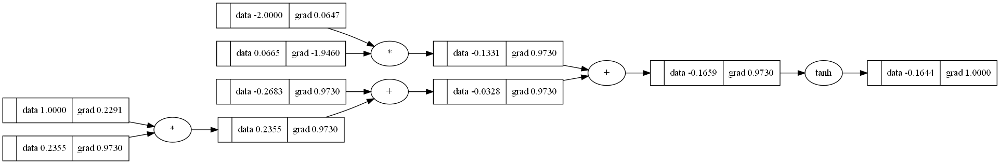

# micrograd


Micrograd is a tiny AutoGrad engine. It implements backpropogation (reverse order auto-differentiation) over a dynamically build small Neural Networks library on top of it with a PyTorch-like API (`micrograd.engine`).

### Example usage

Below is a slightly contrived example showing a number of possible supported operations:
```
from micrograd.engine import Value

a = Value(-4.0)
b = Value(2.0)
c = a + b
d = a * b + b**3
c += c + 1
c += 1 + c + (-a)
d += d * 2 + (b + a).tanh()
d += 3 * d + (b - a).tanh()
e = c - d
f = e**2
g = f / 2.0
g += 10.0 / f
print(f'{g.data:.4f}') # prints 24.7041, the outcome of this forward pass
g.backward()
print(f'{a.grad:.4f}') # prints 138.8338, i.e. the numerical value of dg/da
print(f'{b.grad:.4f}') # prints 645.5773, i.e. the numerical value of dg/db
```

### Tracing / visualization
For added convenience, the notebook trace_graph.ipynb produces graphviz visualizations. E.g. this one below is of a simple 2D neuron, arrived at by calling draw_dot on the code below, and it shows both the data (left number in each node) and the gradient (right number in each node).

```
from micrograd import nn
n = nn.Neuron(2)
x = [Value(1.0), Value(-2.0)]
y = n(x)
dot = draw_dot(y)
```


**This project was made possible because of this <a href="https://www.youtube.com/watch?v=VMj-3S1tku0&list=PLAqhIrjkxbuWI23v9cThsA9GvCAUhRvKZ&index=2">lecture</a> by _Andrej Karpathy_, and <a href="https://www.youtube.com/playlist?list=PL3FW7Lu3i5JvHM8ljYj-zLfQRF3EO8sYv">Stanford's cs231n course</a>.**

### License
This project is licensed under the `MIT License`.
